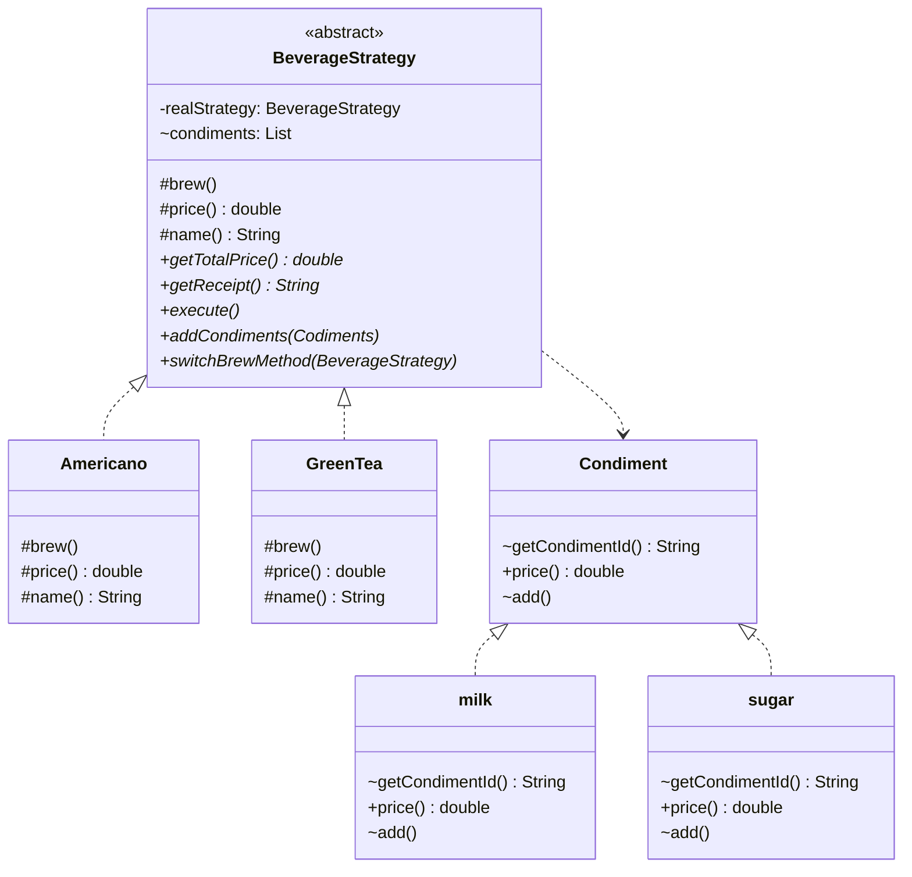

# Fully Automatic Beverage Vending Machine

## UML



## Implement Description

My implement of Automatic Beverage Vending Machine utilize the **Strategy Pattern** as part of my main software design
concepts.

1. Strategy design Pattern
    - Allows the vending machine's behavior to be changed at runtime by invoke different brewing algorithm
      like `Americano`
    - Allows the clients change strategy easily with `switchBrewMethod`.
    - You can also easily add more brewing algorithm with only 2 steps:
        1. create a new class like `RedTea`
        2. Implement the three method to extend `BeverageStrategy` abstract class.
2. Encapsulation
    - Hides the internal state and functionality of the brewing strategies and condiments to prevent unauthorized access
      or changes.
    - The `BeverageStrategy` and `Condiment` abstract class hide some fields like `brew()`,`price()`,`add()`, and only
      expose some methods which are meaningful for users like `execute()` to execute brewing process, `addCondiments()`
      to add condiments into beverage.
    - Only can be implemented in beverage package, in case other package invoke this abstract class and doesn't
      implement abstract method.
3. Abstraction
    - Define some common methods for common logics and abstract methods for specified logics, allowing for flexible
      extension with different beverages.
4. Inheritance
    - Allow developer to extend `BeverageStrategy` and `Condiment` easily.

## How to use?

```java
public void testAllMethods() throws Exception {
    GreenTea beverage = new GreenTea(); // assume you want a green tea
    beverage.addCondiments(new Sugar(), new Milk(), new Milk());// and ass some condiments
    beverage.switchBeverageStrategy(new YellowTea());// then you want to change to yellow tea
    logger.info(beverage.getReceipt());// now you want to take a look at the receipt base on your chose
    beverage.addCondiments(new Sugar());// and you decide to add one more sugar
    logger.info(beverage.getReceipt());// and check the receipt
    beverage.execute();// then begin to brew
    logger.info(beverage.getTotalPrice());// finally, get the total price
}
```

## Compile and Execute the code


